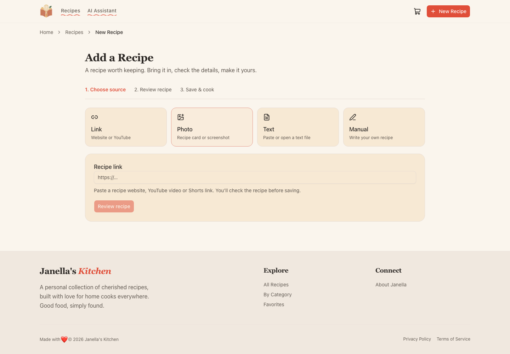
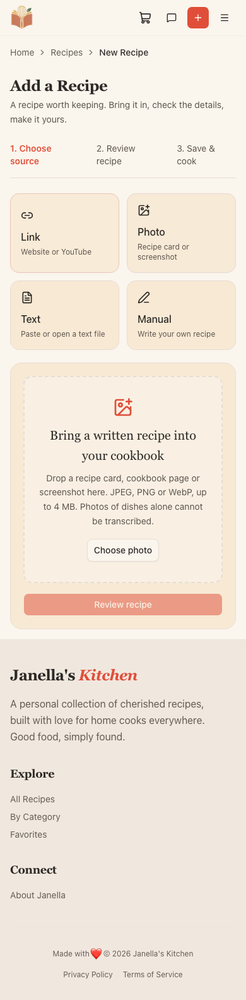
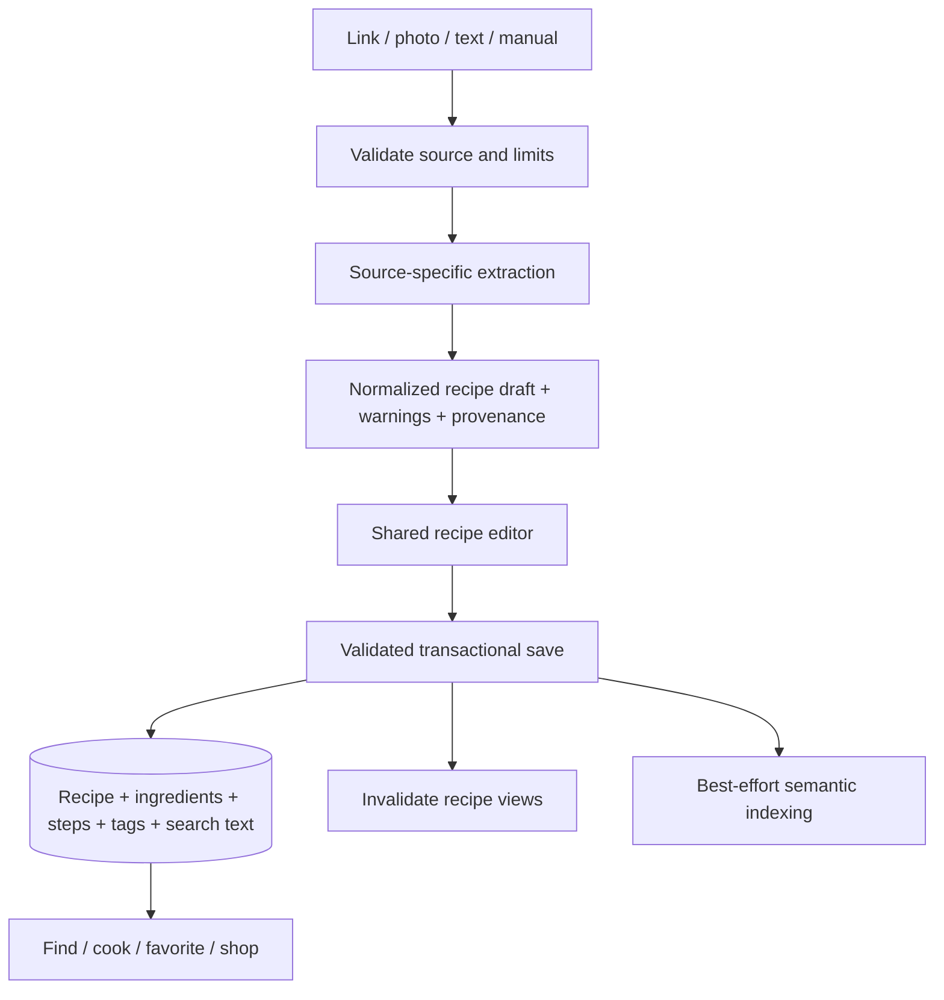
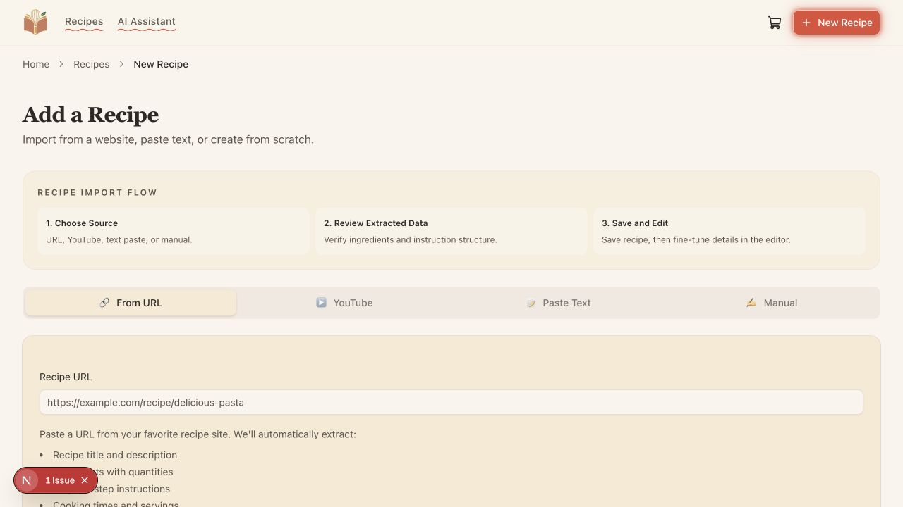
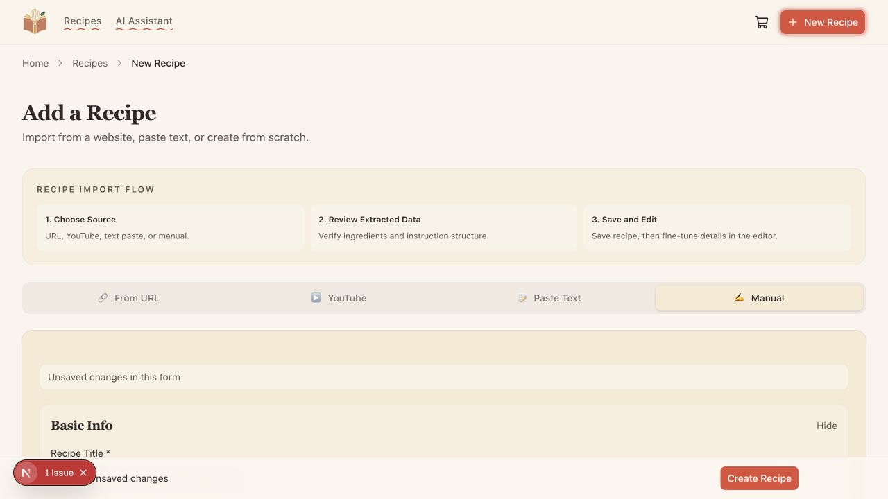
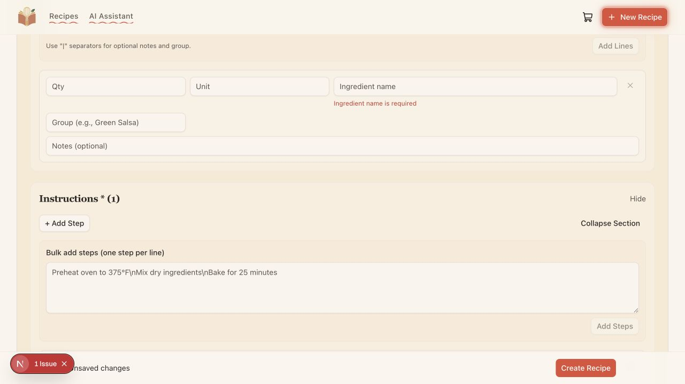

# Cookbook: collect, review, cook

Status: implemented intake and persistence improvements, verified locally September 8, 2026. The original proposal and baseline findings below are retained as historical context; they are not a description of the current application.

## Implementation and verification update

- One Link / Photo / Text / Manual intake workspace now separates extraction, editable review and persistence. Website links and YouTube links share an entry point. JPEG, PNG and WebP recipe images (4 MB maximum) are decoded, bounded and normalized server-side; text files are supported. PDFs and photos of dishes are outside this intake format.
- Re-importing a source offers opening the saved recipe or explicitly reviewing an update. Edits use a version check; creation uses a durable, unique save key so retrying a save returns the same recipe. Manual and reviewed drafts recover from local storage. Original image bytes are not persisted across refresh.
- Source HTML fetching checks public addresses, pins DNS resolution, validates redirects and caps time/body size. Complete schema.org recipes bypass AI. Keyword search text is written with each save, independent of embeddings. Recipe detail and edit pages render current data instead of using the previous 24-hour static cache.
- All generation uses free OpenRouter endpoints. Recipe extraction and nutrition default to `dots-studio/dots-3-note-preview:free`, which advertises image input and structured output; chat defaults to `openrouter/free`. Paid model IDs are replaced by these free defaults; there is no paid fallback. The general free router passed initial live imports but a repeat timed out or produced malformed output, so recipe extraction now uses a specific free model. Hosted Hugging Face embeddings require an explicit opt-in and remain disabled by default. Free models can be unavailable or rate limited; source input remains available to retry.
- Isolated local PostgreSQL + pgvector runs in `janella-qa-6817` on port 55417. No production database was changed. The new save-key migration must be deployed before releasing the application.
- Production compilation and TypeScript validation passed using webpack. The default build command uses this verified compiler; the Turbopack attempt stalled during compilation in this environment. Lint exits successfully with warnings, including existing UI primitive warnings; UI primitives were not edited.
- The final combined suite passed all 41 checks in 29.9 seconds against the production build, including live external imports. Standard checks cover create/reopen/edit, safe save replay, ingredient search, favorites, cooking count, shopping persistence, navigation, categories and static pages. The narrow-screen check passed at 390 px with no horizontal overflow. Live free-provider text and photo extraction passed. A live Good Food website import and duplicate-preservation flow passed. Nutrition returned a successful text stream from the free provider.
- Chat's external grocery authorization boundary returned the expected 401 with an authorization URL. Authenticated grocery/chat tool execution and a live YouTube transcript success have not been verified. Production deployment and full assistive-technology testing remain outside the completed local checks.

## Reproduce local QA

Use an isolated migrated database and `OPENROUTER_API_KEY`. Run `pnpm build`, start on port 3017, then run `PLAYWRIGHT_BASE_URL=http://localhost:3017 pnpm exec playwright test --workers=2`. External-provider checks are opt-in: `LIVE_IMPORT_TESTS=1 PLAYWRIGHT_BASE_URL=http://localhost:3017 pnpm exec playwright test e2e/live-imports.spec.ts --workers=1`. These tests create recipe fixtures in the configured database; never point them at production.

## Product direction

Keep the warm cream, terracotta and sage palette, Fraunces headings, Outfit controls, and existing Base UI primitives. Make the cookbook feel like a personal collection with a dependable intake process. The primary journey is **bring in a recipe → check it → save it → find it → cook it**.

Use the existing routes. Recipes is the collection, with search, favorites, categories and sorting together. Add Recipe is a focused workspace. Recipe detail is the cooking surface. Keep the assistant and shopping drawer available without making an external AI or grocery connection a prerequisite for collecting or cooking recipes. Keep dashboard and static pages reachable as secondary navigation.

## Source findings

| Finding                                   | Evidence                                                                                                              | Consequence                                                              |
| ----------------------------------------- | --------------------------------------------------------------------------------------------------------------------- | ------------------------------------------------------------------------ |
| Review is promised but skipped            | `app/recipes/new/page.tsx` describes review; the three import forms call saving actions directly                      | Users cannot correct extraction before writing to the collection         |
| Re-import replaces content immediately    | `importFromUrl` and `importFromYouTube` in `lib/actions.ts` call `updateRecipe` for matching URLs                     | A repeated link can replace manually corrected ingredients and steps     |
| File upload is missing                    | Four forms exist; manual entry accepts an image URL; no file intake route exists                                      | A photo of a recipe cannot enter the extraction workflow                 |
| Keyword indexing depends on embeddings    | `createRecipeInDb` gets no search text from import callers; `deferEmbeddingGeneration` returns when its key is absent | Ingredient-only keyword searches can miss newly saved recipes            |
| Invalidation is incomplete                | `revalidateRecipes` invalidates home and detail, but not collection, favorites, categories or dashboard               | Other recipe views can retain stale results                              |
| Runtime mutation validation is incomplete | `createRecipe` checks only the title; `updateRecipe` trusts its typed argument                                        | Direct callers can bypass the form schema                                |
| Draft handoff is fragile                  | `getImportDraft` reads and removes session storage during render                                                      | Draft handling is not explicit, durable or safe under repeated rendering |
| Upload tests do not save recipes          | `e2e/add-recipe.spec.ts` checks headings, tabs and breadcrumbs                                                        | A green suite does not establish that ingestion works                    |

These are source findings. Browser observations and runtime results must be recorded separately.

## Add Recipe design

### 1. Choose a source

One page heading, a compact step indicator and source choices: Link, Photo, Text, Manual. A link accepts recipe websites and recognized YouTube URLs, choosing the appropriate extractor automatically. Do not make users know which parser a URL needs.

Photo means a readable recipe page, card or screenshot. Dish photography belongs in the editor's cover-photo control and must not be treated as evidence for invented ingredients. Start with JPEG, PNG and WebP. PDF support is a separate extension with page selection, page limits and multi-recipe handling; do not advertise it until implemented.

The photo area supports file picking and drag-and-drop with a visible keyboard-operable button. Display accepted formats and size limits before selection. After selection, show the filename, preview, remove control and a single **Review recipe** action. Text supports paste and plain-text files. Manual opens the same editor with a blank draft.

Retain each source's entered content when switching methods. Disable conflicting transitions while extraction is active. Use truthful states: uploading, reading recipe, ready for review; do not show a fabricated percentage for AI parsing.

### 2. Review a draft

Desktop: source preview on the left and the editable recipe on the right. Mobile: editor first, with a collapsible source preview. Reuse one recipe editor for imports, manual creation and later edits.

Show title, quantities, ingredients, ordered steps, times and servings first. Put cuisine, tags, difficulty, notes and cover image in optional details. Keep ingredient/step grouping. Missing quantities remain blank rather than invented. Display extraction warnings next to the affected fields. Focus the first invalid field, expanding its section when necessary.

The footer has one primary action, **Save recipe**. Back returns to the source without losing entered content. Save failure preserves all edits and displays an inline retryable error. Refresh restores a draft where storage is available; storage failure must not make the editor unusable.

For a known source, show the existing title and offer **Open existing recipe** or **Review an update**. Never silently replace a saved recipe. Reviewing an update loads a proposed draft, preserves personal notes/favorite/cook history, and saves against the existing recipe identity only after an explicit update action.

### 3. Save and cook

Save once and navigate to the real persisted recipe. The new recipe must appear immediately in the collection and keyword search. Semantic indexing happens after save and cannot turn a successful save into a user-visible failure.

Recipe detail prioritizes ingredients and steps, followed by favorite, shopping list and cooked actions. Editing, printing, regeneration and deletion remain available through clear secondary controls. Regeneration returns to review. Print output excludes navigation and action controls.

## Architecture

Keep Next.js, PostgreSQL and the existing parser integrations. Split responsibilities before considering new infrastructure.

Suggested boundaries:

- `lib/recipes/service.ts`: validated create/update commands, transactions, source identity, synchronous keyword text and invalidation.
- `lib/imports/service.ts`: orchestrates extraction into drafts; never saves recipes.
- `lib/imports/sources/`: URL, YouTube, text and photo adapters behind one typed output contract.
- `lib/imports/validation.ts`: source limits, supported formats, canonical URLs and byte checks.
- `components/forms/recipe-editor.tsx`: shared editor accepting an explicit draft and save callback; no destructive storage reads during render.
- `components/forms/recipe-intake.tsx`: source choice and extraction state; source-specific inputs remain small components.
- Server Actions and API routes: thin adapters returning one discriminated result contract.

Drafts should carry `sourceType`, original and canonical source URL where relevant, parsed fields, warnings, and an optional existing recipe ID. A preview does not require a database write. Source identity must not be inferred from editable recipe fields alone.

### Persistence and retries

Create tags and nested recipe content in one transaction. Validate both create and partial update inputs at the server boundary. Calculate keyword search text inside that transaction. Invalidate all affected routes only after commit. Preserve the existing atomic nested-update behavior.

For idempotent saving, use a unique client-generated save key stored with the resulting recipe or import record. Double-clicks, request retries and a lost response must resolve to the same saved recipe. Disable-submit is helpful UI behavior but is not sufficient duplicate protection.

Canonicalize YouTube links by video ID and website links conservatively; do not discard query parameters that identify a recipe. Before adding a unique source constraint, inventory and reconcile existing duplicate sources. An existing URL match requires an explicit update choice. Use an expected version/updated-at check to avoid replacing concurrent edits.

### Photos and external sources

Validate byte length and decoded format on the server, not only extension or browser MIME type. Bound upload size, decoded dimensions, fetch time, redirect count and extraction time. Reject empty, unsupported or unreadable files with actionable messages. Prevent URL extraction from reaching private/local addresses, including redirected targets.

Read a photo with a verified vision-capable model and the same structured recipe schema. Do not infer a full recipe from a dish photo. Preserve uncertainty rather than hallucinating measurements. Keep source image storage separate from the recipe cover image. If original uploads are retained, use object storage with explicit retention and cleanup; never save temporary browser blob URLs as durable image URLs.

Begin with bounded synchronous extraction if it reliably fits deployment timeouts. Move to persisted import jobs only when measured latency, multi-page inputs or resumability require it. A future job has explicit queued, extracting, ready, failed and saved states; retry resumes extraction without creating another recipe.

## Feature acceptance matrix

Every row requires behavior evidence, not just a rendered control.

| Feature                        | Acceptance test                                                                                                                                                |
| ------------------------------ | -------------------------------------------------------------------------------------------------------------------------------------------------------------- |
| Website import                 | Extract a known recipe, review without a DB write, change a quantity, save, reopen and compare persisted content                                               |
| Website failure                | Timeout, non-recipe page, blocked source and invalid URL retain input and offer pasted-text recovery                                                           |
| YouTube                        | Valid video resolves to a draft; unavailable transcript reports an actionable error; equivalent URL forms find the same source                                 |
| Photo/screenshot               | Real fixture extracts title/ingredients/steps; unsupported, oversized, empty and unreadable inputs fail before save                                            |
| Text/text file                 | Same content produces equivalent draft fields; blank and over-limit content is rejected                                                                        |
| Manual entry                   | Create with required fields; optional details stay optional; field errors are reachable by keyboard                                                            |
| Review recovery                | Switch source, go back, refresh and retry a failed save without losing edits                                                                                   |
| Duplicates/retries             | Double submission and retry after a lost response create one recipe; repeat source never silently replaces edits                                               |
| Edit/regenerate                | Preserve grouping/order, provenance and personal metadata; update is atomic; regeneration requires review                                                      |
| Collection/search              | Newly saved recipe appears immediately; ingredient-only keyword search works without embedding credentials; filters and pagination compose correctly           |
| Favorites/categories/dashboard | Mutations and deletion update all affected pages and counts                                                                                                    |
| Cook/print                     | Steps and ingredient checks work on mobile; cooked count persists; print hides app controls                                                                    |
| Shopping list                  | Add recipe ingredients, adjust/check/remove items, reopen drawer and verify intended persistence behavior                                                      |
| Assistant/voice                | Stream and tool errors are recoverable; OAuth and microphone denial are explicit; failures leave recipe functions usable                                       |
| Nutrition                      | Distinguish stored/estimated/missing values; failed analysis does not block recipe display                                                                     |
| Responsive/accessibility       | 390px and desktop layouts; keyboard-only source selection, upload, review and save; meaningful status announcements and errors; no nested interactive controls |
| Static/navigation/theme        | Every existing route remains reachable, active states are correct, and light/dark themes remain legible                                                        |

Use deterministic source/parser fixtures against an isolated test database for required CI. Keep a separate opt-in live-provider smoke suite for actual website extraction, transcript availability, vision and model credentials. A fixture pass establishes application behavior, not live provider availability.

## Delivery order

1. Establish a repeatable local runtime and capture baseline flows. Add a real create/reopen/edit/search test.
2. Separate extraction from persistence and wire existing sources through the shared review editor. Fix server validation, keyword indexing and invalidation together.
3. Add photo/text-file intake with real error states and source previews. Verify extraction against actual supported providers.
4. Add durable draft recovery, idempotent save and explicit duplicate/update handling. Migrate existing source identities only after a read-only duplicate inventory.
5. Verify the full feature matrix, desktop/mobile interactions and live-provider checks. Deploy only after the gates are green.

## Baseline runtime evidence (before implementation)

- The worktree began clean and without installed dependencies.
- `railway status --json` reports no linked project. `railway list --json` shows a `recipes` project with a `pgvector` service, but does not show the documented `surprising-growth` application service. The repository's deployment instructions therefore need live reconciliation.
- Docker is installed but its configured OrbStack socket is unavailable, so an isolated local PostgreSQL instance is not currently running through Docker.
- `pnpm install --frozen-lockfile` completed successfully, including dependency policy verification and Prisma generation.
- `pnpm exec tsc --noEmit` passed. `pnpm lint` exited successfully with existing React and accessibility warnings. These checks establish baseline code health, not feature correctness.
- Local Next.js started successfully on port 3017 using a placeholder local database URL. The add-recipe page rendered in the in-app browser; no live database or AI credentials were used, and no recipe was saved.

## Baseline browser audit (before implementation)

1. **Source selection — usable, but misleading.** The four source tabs render and switch correctly. The step panel promises review that the saving actions do not implement. At 1280×720, introductory content consumes enough vertical space that the main import action is below the first viewport. Preserve the warm visual treatment but make the step indicator compact.

   

2. **Manual draft — data-loss failure.** Entered `Draft preservation check` in the title, selected From URL, and returned to Manual. The title was empty. A fresh form also displayed “Unsaved changes” before entering any data. Source panels unmount their form state on switching. The new architecture must retain source drafts independently of the active panel.

   

3. **Required-field validation — partially working.** Submitting the empty manual form displayed title, ingredient and instruction errors without saving. Focus landed on Prep Time rather than the invalid title. Ingredient inputs exposed generated identifiers instead of useful accessible names, and the step textarea had no name in the accessibility tree. Visible placeholder text does not replace persistent labels. The bulk-step example also displays literal `\\n` text rather than separate lines.

   

4. **Extraction, review, persistence and post-save features — not verified.** No photo path exists to exercise. Successful parsing and save/reopen verification require a working test database and configured providers. This pass does not establish that imports, search, favorites, shopping, assistant, nutrition or production deployment work end to end. The matrix above defines the remaining verification rather than marking those features as passing.

Screenshots are desktop evidence only; mobile, full keyboard traversal, screen-reader behavior and measured contrast remain to be checked. The Next.js issue badge is development UI. The corresponding browser log reports that `getServerSnapshot` in `components/providers/session-provider.tsx:71` must be cached to avoid an infinite loop. Investigate this shared session/shopping state defect before calling the wider feature suite healthy. A separate logo warning reports a missing image `sizes` prop.

Original proposal-only deliverable scope: that pass added the architecture/design proposal and three captured screenshots. At that time application code was unchanged. The temporary development server was stopped after inspection.
